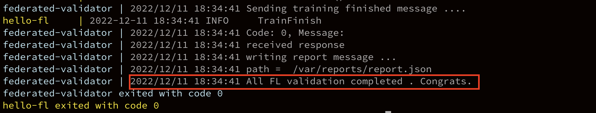
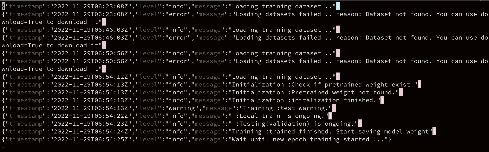

# What is FL validator

FL validator is a tool which can be used to validate whether your FL application container has been correcly implemented with our GRPC interface.

# Getting started

There are things one will need to do before using the fl validator. Things are as below.

* 1. Know how to make a valid fl application image. This can be learned from our Hello FL project. The following link will get you there.

[Hello FL](https://gitlab.corp.ailabs.tw/federated-learning/hello-fl)

* 2. You will need to make a docker image (with all GRPC interfaces implemented) according to Hello FL. That us name it *3rd_application*.

* 3. Alter the *docker-compose.yml* in this project.
  * Change full image name of app (now is registry.corp.ailabs.tw/federated-learning/hello-fl/edge:1.3.4) to the container name you just built from your Dockerfile (usually at the 5th line in docker-compose.yml in our project)

  * There are 2 environmental variables *LOCAL_MODEL_PATH* and *GLOBAL_MODEL_PATH* need to be set. *LOCAL_MODEL_PATH* is where you will place the model weight after you have trained a new weight per epoch.
  （The given example value of *LOCAL_MODEL_PATH* is ```/model/weight.ckpt```）
  And *GLOBAL_MODEL_PATH* is the path where you will load your pre-trained model or the globally merged model
  （The given example value of *GLOBAL_MODEL_PATH* is ```/model/merge.ckpt```）

  * *NVIDIA_VISIBLE_DEVICES* need to be set as the index of the GPU card you will use.
  （The given example value of *NVIDIA_VISIBLE_DEVICES* is ```0```, because only choose first GPU card to do training.）

  * The docker-compose's mounting path（```volumes:```arguments） also needs to be altered. There are two paths that need to be set . One is *model path*, and another is *data path*.
    * *model path* is where you should put the merged global model weight and the local model weight. And this will be the folder path (without file name) of the *LOCAL_MODEL_PATH*.
    * *data path* is where you should put your training datasets correspond to the path you will load your datasets from.

* 4. There are two modes for one can choose. One can set the value of ```DRY_RUN``` argument in environment variables setting in validator in our docker-compose.yml to decide whether to enable dry run or not.
  * ```DRY_RUN='True'``` will open DRY RUN mode and the validator will only test the five GRPC interfaces for you.
  * ```DRY_RUN='False'``` will close DRY RUN and mode and the validator will do a full round of training tests.

  There is an important thing one needs to know. That is if one wants to open DRY RUN mode, their GRPC server implemented in *3rd_application* will need to handle ```DRY RUN mode message``` which is packaged in the context of every GRPC call validator makes.

  The ```DRY RUN mode message``` is a key-value pair (the key is a string and the value is bool) as below.
    ```bash
      "draftRun", true
    ```
    Or

    ```bash
      "draftRun", false
    ```

* 5. After you have set 1-3 above, you can simply run our validator with command as below.

```bash
docker-compose up -d
```

## What will be validated ?
  * The four GPPC interfaces : *DataValidation*, *TrainInit*, *LocalTrain*, *TrainFinish* will be validated. (There are five GRPC interfaces actually, but currently *TrainInterrupt* do not be used.) You will know whether your image has successfully implemented the basic interface to fit our federated learning system. A report.json file will be created at */var/reports/report.json* (You can change this path in docker-compose.yml, the outside path correspond */var/report*)

<div align="left"></img></div>

  * Whether your image can successfully do the first round of federated learning. If you have successfully done one round of federated learning, you will see the message below finally.
  And both your app and our validator will end up exit 0 soon.

<div align="left"></img></div>


  * If your image have successfully implemented the log interface as the example (Hello FL), you will see a log file located at */var/logs/log.json*.

  <div align="left"></img></div>