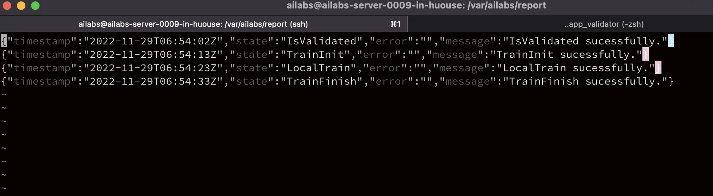

# What is FL validator

FL validator is a tool which can be used to validate whether your FL application container has been correctly implemented with our gRPC interface.

# Getting started

There are few things you will need to do before using the fl validator. The things are below.

1. Know how to make a valid fl application image. This can be learned from our Hello FL project. The following link will get you there.
      [Hello FL](https://github.com/ailabstw/Hello-FL)

2. You will need to make a docker image (with all gRPC interfaces implemented) according to Hello FL. Let's call it **my_application**.

3. Alter the **docker-compose.yml** file in this project.

  * Change the image of the container ```app``` (which is ```registry.corp.ailabs.tw/federated-learning/hello-fl/edge:1.3.4``` now) to the image you have built.(at the 5th line in docker-compose.yml)
      ```yaml
        app:
          container_name: app
          image: registry.corp.ailabs.tw/federated-learning/hello-fl/edge:1.3.4
      ```

  * There are few environmental variables that need to be set.

    **LOCAL_MODEL_PATH** : is where you will place the model weight after you have trained a new weight per epoch.
  （The given example value of ```LOCAL_MODEL_PATH``` is ```/model/weight.ckpt```）

    **GLOBAL_MODEL_PATH** :is the path where you will load your pre-trained model or the globally merged model
  （The given example value of ```GLOBAL_MODEL_PATH``` is ```/model/merge.ckpt```）

      ```yaml
          environment:
            LOCAL_MODEL_PATH: /model/weight.ckpt
            GLOBAL_MODEL_PATH: /model/merge.ckpt
            NVIDIA_VISIBLE_DEVICES: 0
            OPERATOR_URI: validator:8787
      ```

  * **NVIDIA_VISIBLE_DEVICES** : need to be set as the index of the GPU card you will use.
  （The given example value of ```NVIDIA_VISIBLE_DEVICES``` is ```0```, because only choose first GPU card to do training.）

      ```yaml
          environment:
            NVIDIA_VISIBLE_DEVICES: 0
            OPERATOR_URI: validator:8787
      ```

  * The docker-compose's mount points（```volumes:```） also needs to be altered. There are two paths that need to be set . One is *model path*, and another is ```data path```.
    * **model path** is where you should put the merged global model weight and the local model weight.
    * **data path** is where you should put your training datasets.

      ```yaml
        runtime: nvidia
        volumes:
          - /var/model:/model # This is the path of your model
          - /var/data:/data # This is the path of your data
        ports:
      ```

4. **DRY_RUN** : Set this value to enable or disable ```DRY_RUN```.
        * ```DRY_RUN='True'``` enable DRY RUN mode. The validator will only test the five gRPC interfaces of your ```my_application```.
        * ```DRY_RUN='False'``` disable DRY RUN and mode. The validator will test a full round of training with your ```my_application```.

      Be noted that if you want to enable DRY RUN mode, your gRPC server will need to handle ```DRY RUN mode message``` which is packaged in the context of every gRPC call the validator makes.


      The ```DRY RUN mode message``` is a key-value pair as below.
      ```yaml
          "dryRun":true
      ```
      Or

      ```yaml
          "dryRun": false
      ```
All your gRPC interfaces should immediately return OK once you have received ```"draftRun", true``` after parsing the context contained in a GPPC call.


5. After you have set 1-4 above, you can simply run our validator with command as below.

```bash
docker-compose up -d
```


## What will be validated ?

  * **DataValidation**, **TrainInit**, **LocalTrain**, **TrainFinish** : these four gRPC interfaces will be validated. (The **TrainInterrupt** is not tested.) You will know whether your docker image is compatible with Ailab's FL gRPC interface protocol or not. A **report.json** file will be created at ```/var/reports/report.json``` in the container. You can mount a local path at this mount point.


<div align="left"></img></div>

  * **Whether your image can successfully do the first round of federated learning** : If you have successfully done one round of federated learning, you will see the message below finally.
  And both your app and our validator will end up exit 0 soon.

<div align="left"></img></div>

  * **Whether your image have successfully implemented the log interface**:  If you have implemented the log interface, you can use the log interface to output logs and finally you can find a log file at ```/var/logs/log.json``` in your container.

  <div align="left"></img></div>
